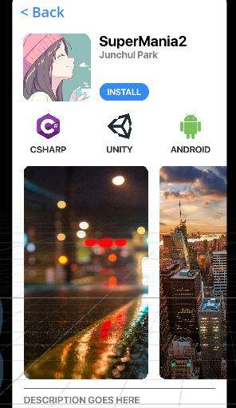

# ui
Unity Interface

Doge coin
----


```html
<body>
  
  <div>
    <text id="title">SuperMania2</text>
    <text id="developer">Junchul Park</text>
    <button id="install">INSTALL</button>
  </div>
  
  <scroll>
     
     
     
  </scroll>
</body>
```
```css
#title {
  font-size: 50;
}

img {
  width: 100;
  height: 100;
}
```
